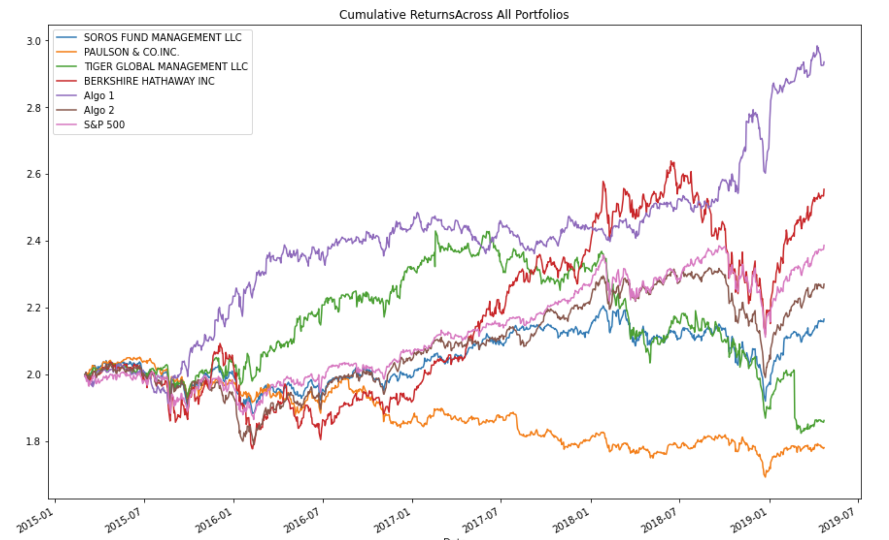
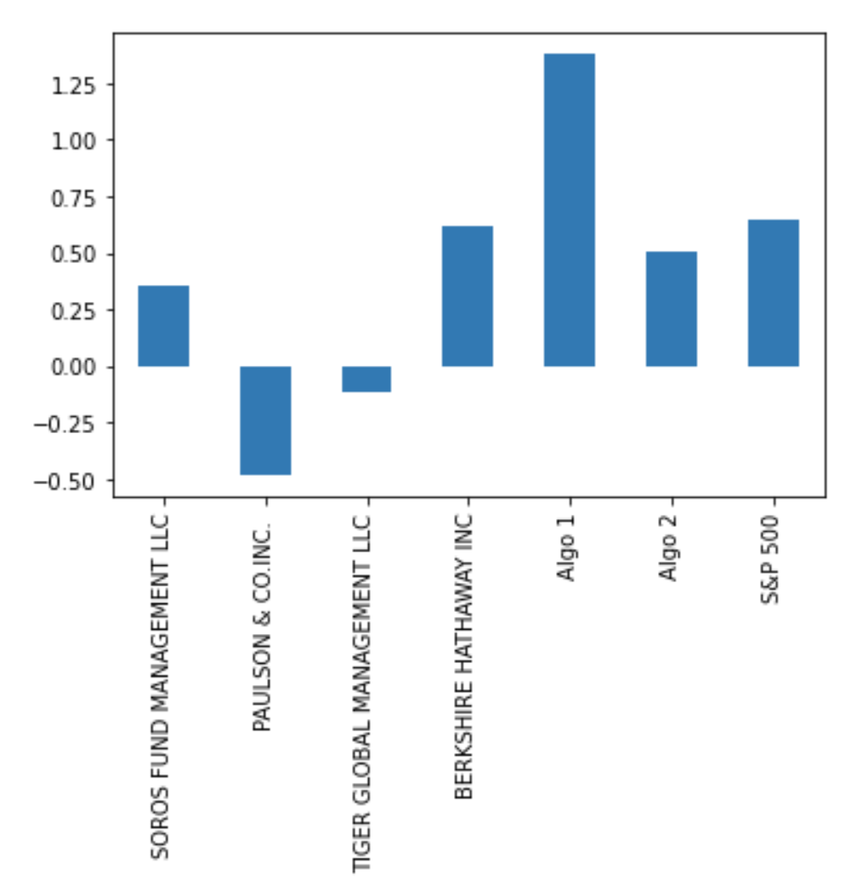
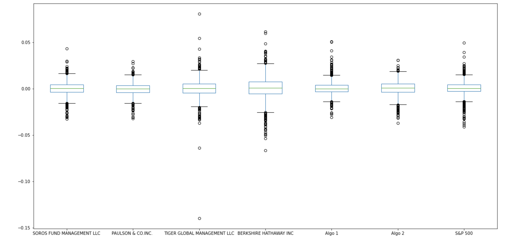

# Zeldas_Invesment_Sector_Analysis
Help Zelda determine which portfolio is performing the best across many areas: volatility, returns, risk, and Sharpe ratios.
  
  
  
  

## Background

The investment division of Zelda's company has been investing in algorithmic trading strategies. Some of the investment managers love them, some hate them, but they all think their way is best.

You just learned these quantitative analysis techniques with Python and Pandas, so Zelda has come to you with a challenge—to help him determine which portfolio is performing the best across many areas: volatility, returns, risk, and Sharpe ratios.

You will need to create a tool (an analysis notebook) that analyzes and visualizes the major metrics of the portfolios across all of these areas, and determine which portfolio outperformed the others. You will be given the historical daily returns of several portfolios: some from the firm's algorithmic portfolios, some that represent the portfolios of famous "whale" investors like Warren Buffett, and some from the big hedge and mutual funds. You will then use this analysis to create a custom portfolio of stocks and compare its performance to that of the other portfolios, as well as the larger market (S&P 500).
 Tasks To Accomplish :

1. [Read in and Wrangle Returns Data](#Prepare-the-Data)
2. [Determine Success of Each Portfolio](#Conduct-Quantitative-Analysis)
3. [Choose and Evaluate a Custom Portfolio](#Create-Custom-Portfolio)

---

# Instructions

## Prepare the Data

 
### Conduct Quantitative Analysis

#### Performance Analysis

#### Risk Analysis

#### Rolling Statistics

#### Plot Sharpe Ratios

#### Create Custom Portfolio

Zelda is ecstatic that you were able to help him prove that the algorithmic trading portfolios are doing so well compared to the market and whales' portfolios. However, now you are wondering whether you can choose your own portfolio that performs just as well as the algorithmic portfolios. Investigate by doing the following:

Add your portfolio returns to the DataFrame with the other portfolios and rerun the analysis. How does your portfolio fair?

##  Analysis included the following:

  - The annualized standard deviation (252 trading days) for all portfolios.
  - The plotted rolling standard deviation using a 21 trading day window for all portfolios.
  - The calculated annualized Sharpe Ratios and the accompanying bar plot visualization.
  - A correlation table.

---

### Daily Returns

 
Between all portfolios  Tiger Global Management LLC daily returns are the most volatile, the green spikes show that price action.

---

### Cumulative Returns 

 Algo 1 portfolio cumulative returns performed better then the  whales and S&P 500 overtime.
 
 ---
 
### Sharpe Ratio
 
 
 Aglo 1 again shows promising returns based on the sharpe ratio. S&P 500, Algo 2, and whales a struggling to keep up. 
 
 
 ---
 
 ### Risk
 
 
 
 
 Tiger Global has the most risk and one of the worst sharpe ratios. I would advice to stay away from the investment.
 
 
 ### 21 Day Rolling Standard Deviation 
 
 
 
 Berkshire Hathaway and Tiger Global have very high standard deviations, which tells us it's averages are far from the mean.  
 
 
 
 
 

